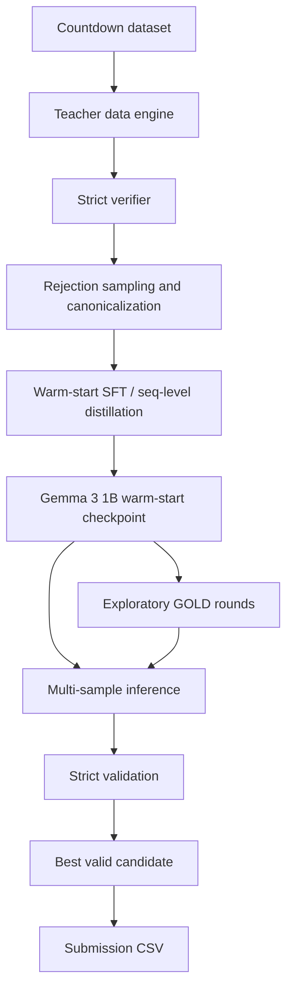

# countdown-distillation-gemma

Teacher-student distillation pipeline for the `Countdown` task built around `google/gemma-3-1b-it`, verified teacher generations, rejection sampling, SFT warm-start, exploratory GOLD refinement, and strict validated inference.

## Overview

This project studies how to train a compact `Gemma 3 1B` student to solve arithmetic `Countdown` problems under competition-style constraints:

- the final answer must be produced by the model itself;
- teacher and student come from different model families;
- the output must be a valid arithmetic expression that uses only the provided numbers;
- external code may validate and rank generated candidates, but must not solve the task for the model.

The repository is designed as a research-to-pipeline project: from early baselines and teacher data generation to warm-start distillation, on-policy refinement experiments, and final multi-sample inference for submission.

## Problem

Given:

- a target number;
- a small set of numbers;

the model must generate a single arithmetic expression using only `+`, `-`, `*`, `/` and parentheses, with each number used at most once, such that the expression evaluates exactly to the target.

Example:

```text
Numbers: [53, 50, 30]
Target: 90
Answer: (53 - 50) * 30
```

## Why this project is interesting

This is not a generic fine-tuning exercise. The project combines several non-trivial constraints at once:

- cross-tokenizer distillation: teacher and student are from different model families;
- symbolic correctness matters more than fluent text;
- errors are often structural, not stylistic;
- a small model must learn to produce short, exact, valid expressions;
- the final quality depends heavily on data construction and validation, not only on the training loop.

## What was implemented

The project evolved through several stages.

### 1. Baseline distillation

The initial baselines focused on a simple teacher-to-student SFT pipeline:

- generate teacher responses;
- parse candidate equations;
- validate arithmetic correctness;
- build an SFT dataset for the Gemma student;
- fine-tune with LoRA / QLoRA;
- evaluate on a local validation subset.

### 2. Stronger teacher data engine

The teacher stage was then upgraded into a more serious data engine:

- stricter prompting;
- multiple generations per prompt;
- rejection sampling;
- strict verification;
- filtering by equation validity;
- canonicalization of final answers into a narrow target format.

This part became one of the most important contributions of the project.

### 3. Warm-start student

The strongest stable quality jump came from the warm-start stage:

- train `google/gemma-3-1b-it` on verified, canonicalized, final-only targets;
- force a narrow output format:

```text
Answer: <expression>
```

- optimize for exact target hit instead of verbose reasoning quality;
- monitor syntax validity, number usage validity, and exact target hit.

### 4. Exploratory GOLD refinement

After warm-start, the project explored `GOLD`-style on-policy refinement:

- hybrid imitation + rollout loss;
- student-generated trajectories;
- teacher rescoring;
- hard-example sampling;
- multiple refinement rounds.

This part was useful as research, but did not become the final central claim of the project. The best improvement appeared early, and additional rounds no longer improved quality consistently.

### 5. Final inference and submission pipeline

The inference stage uses:

- multi-sample generation;
- strict verifier;
- retry sampling;
- candidate ranking and selection;
- submission file creation.

This keeps the model as the source of the answer, while external code only validates and selects among generated candidates.

## Final pipeline



## Key design decisions

### Narrow target format

A major lesson of the project is that a compact model performs better when the target format is narrow and stable.

Instead of training the student to produce long reasoning traces, the project converged on:

```text
Answer: <expression>
```

This reduces output entropy and improves:

- syntax-valid rate;
- numbers-valid rate;
- exact target hit;
- robustness at inference time.

### Strict verifier everywhere

The verifier is a core part of the project. It is used to check:

- syntax validity;
- whether only the allowed numbers were used;
- whether each number was used at most once;
- whether the expression evaluates to the target.

The verifier is used in:

- teacher filtering;
- local evaluation;
- rollout selection;
- inference-time candidate ranking.

### Warm-start before on-policy refinement

Another key result is that `GOLD` should not be run from scratch. The student first needs a good warm-start so it can already:

- output the right format;
- stay inside the Countdown solution space;
- avoid obvious structural mistakes.

Only after that does on-policy refinement become meaningful.

## Experiment progression

The project went through the following stages:

| Stage | Main idea | Key result |
|---|---|---|
| `Baseline v1` | minimal teacher-to-student SFT | very low valid teacher yield and weak validation quality |
| `Baseline v2` | stronger teacher generation and local validation | noticeable but still limited improvement |
| `Baseline v3` | stricter prompting and rejection sampling | better local accuracy despite smaller clean teacher subset |
| `Warm-start` | verified final-only targets for Gemma | first strong stable improvement |
| `GOLD round 0/1/2` | on-policy refinement with hybrid loss | early gain, then plateau / slight regression |
| `Inference pipeline` | multi-sample generation + strict validation | best practical submission-time behavior |

## Metrics snapshot

These are the compact summaries currently stored in [`results/`](/Users/kite/countdown-distillation-gemma/results).

| Stage | Main numbers |
|---|---|
| `Baseline v1` | `teacher_valid_rate = 0.0156`, `validation_accuracy = 0.01` |
| `Baseline v2` | `teacher_valid_rate = 0.02`, `validation_accuracy = 0.05` |
| `Baseline v3` | `teacher_valid_rate = 0.0111`, `validation_accuracy = 0.075` |
| `Warm-start` | `syntax_valid_rate = 1.0`, `numbers_valid_rate = 0.995`, `exact_target_hit_rate = 0.50` |
| `GOLD round 00` | `exact_target_hit_rate = 0.555` |
| `GOLD round 01` | `exact_target_hit_rate = 0.58` |
| `GOLD round 02` | `exact_target_hit_rate = 0.55` |
| `Final inference summary` | `pass@1 = 0.129`, `pass@k = 0.234`, `fraction_with_at_least_one_valid_candidate = 0.234` |

## What the results mean

The project suggests the following practical conclusion:

- the biggest and most reliable gain came from better teacher data and warm-start training;
- `GOLD` was useful as an explored refinement strategy, but did not continue to improve after the first strong round;
- narrow output formatting and strict validation mattered more than long reasoning traces;
- multi-sample inference is important even for a reasonably trained student.

So the repository should be read as:

- a strong `Countdown` distillation project;
- a careful warm-start pipeline for Gemma;
- an honest experimental exploration of `GOLD`, not a claim that `GOLD` became the final dominant solution.

## Repository structure

```text
countdown-distillation-gemma/
├── README.md
├── pyproject.toml
├── requirements.txt
├── .gitignore
├── docs/
│   ├── architecture.md
│   ├── methodology.md
│   ├── experiment-log.md
│   └── results.md
├── configs/
│   ├── teacher_engine.json
│   ├── warm_start.json
│   ├── gold_stage.json
│   └── inference.json
├── prompts/
│   ├── teacher_prompt.txt
│   └── student_prompt.txt
├── src/
│   ├── data/
│   ├── teacher/
│   ├── student/
│   ├── inference/
│   ├── eval/
│   └── utils/
├── notebooks/
│   ├── 01_baseline_v1.ipynb
│   ├── 02_baseline_v2.ipynb
│   ├── 03_baseline_v3.ipynb
│   ├── 04_teacher_engine.ipynb
│   ├── 05_warm_start.ipynb
│   ├── 06_gold.ipynb
│   └── 07_inference_submission.ipynb
├── scripts/
├── results/
└── tests/
```

## Important folders

- [`prompts/`](/Users/kite/countdown-distillation-gemma/prompts) contains the teacher and student prompt templates.
- [`configs/`](/Users/kite/countdown-distillation-gemma/configs) stores compact experiment configurations.
- [`results/`](/Users/kite/countdown-distillation-gemma/results) contains small metric summaries extracted from completed experiments.
- [`docs/`](/Users/kite/countdown-distillation-gemma/docs) is intended for architectural notes and experiment summaries.
- [`src/`](/Users/kite/countdown-distillation-gemma/src) is the target home for code gradually migrated out of notebooks.

## Current state of the repository

This repository is intentionally structured for cleanup and long-term use.

At the moment:

- the experiment logic is known and already validated from notebook runs;
- the repository already has a clean modular layout;
- some code is still being migrated from research notebooks into reusable Python modules.

So this should be viewed as:

- a real finished experimental project;
- plus an ongoing repository cleanup and packaging effort.

## Next steps

1. Move stable verifier, metrics, and inference logic from notebooks into `src/`
2. Add CLI entrypoints for teacher generation, warm-start, GOLD rounds, and submission
3. Add proper unit tests for parsing and validation
4. Keep large adapters and heavy artifacts outside git, referenced through external storage

## Short summary

The main value of this project is not just that it fine-tunes a model for Countdown. The real contribution is the full training and evaluation strategy:

- verified teacher data;
- rejection sampling;
- canonical final-answer targets;
- strong warm-start for `Gemma 3 1B`;
- exploratory on-policy refinement with `GOLD`;
- strict multi-sample validated inference.

That makes the repository useful both as a competition solution archive and as a compact case study in distillation for symbolic-generation tasks.
